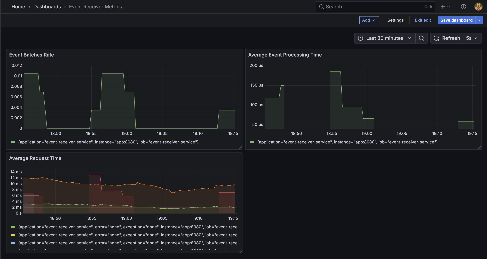

# Event Receiver Service

A Spring Boot application that receives events via HTTP endpoints, processes them in batches, and stores them in AWS S3.

## Features

- HTTP endpoint for event ingestion
- Batch processing of events
- Configurable batch sizes and delays
- AWS S3 storage integration
- Customer tier-based processing
- Async processing with Spring's @Async
- Comprehensive monitoring and metrics
- Retry mechanism for S3 operations

## Prerequisites

- Java 17 or higher
- Maven 3.6 or higher
- AWS account with S3 access
- Docker (for containerized deployment)

## Configuration

The service is configured via `application.yml`. Key configurations include:

- Allowed customer tiers
- S3 bucket settings
- Batch processing parameters
- Server settings

## Configuration Assumptions and Calculations

### Server Configuration
Our application is configured for high throughput (>100 requests/second) with the following settings:

```yaml
server:
   port: 8080
   tomcat:
      threads:
         max: 50
      max-connections: 100
      accept-count: 100
```

#### How These Values Were Calculated

1. **max-threads: 50**
   - This value defines the maximum number of concurrent request-processing threads.
   - Our application accepts large requests (up to 10MB), performs logging, serialization, and metrics tracking — all of which can take 50–200ms per request.
   ```
   Required threads = RPS × average processing time 
                    ≈ 100 × 0.2s = 20 threads
   ```
   - Buffer for traffic spikes (2.5x): 20 * 2.5 = 50

2. **max-connections: 200**
   - This controls the maximum number of simultaneous open connections to the server.
   - Should be higher than threads.max to allow for connection queuing
   - Max-threads = 50
   - Including Buffer for connection queuing (4x): 50 * 4 = 200

3. **accept-count: 100**
   - This is the queue size for incoming connections when all threads are busy
   - Should be large enough to handle traffic spikes
   - Accept-count = max-connections / 2 = 200 / 2 = 100

### Scaling Considerations

1. **Vertical Scaling (Single Instance)**
   - We can choose an EC2 instance with 64 vCPUs (even higher if needed) 
   - Each thread can handle 5 requests/second (1000ms/200ms)
   - Theoretical maximum: 64 threads * 5 req/sec = 320 req/sec
   - Practical maximum: ~250 req/sec (with overhead)

2. **Horizontal Scaling (Multiple Instances)**
   - We can choose an EC2 instance with 64 vCPUs (even higher if needed)
   - Each instance handles 250 req/sec
   - 2 instances = 500 req/sec
   - 3 instances = 750 req/sec
   - Use load balancer for distribution

### Performance Optimizations

1. **Batching**
   - 
   - Batch size: 1000 events
   - Batch max size: 5 mb
   - Batch timeout: 5 seconds
   - On average, if we receive 100 requests/second, each event of size 10KB
   - Number of requests in 5 seconds = 100 * 5 = 500
   - Batch size = 500 events * 10 kb = 5000 kb = 5 mb
   - Hence, 1 S3 write every 5 seconds can handle 500 events of total size 5 MB.
   - This configuration allows us to batch events efficiently, reducing the number of writes to S3.

2. **Connection Pooling**
   - Reuses connections
   - Reduces connection overhead
   - Optimizes resource usage

3. **Async Processing**
   - Non-blocking I/O
   - Better thread utilization
   - Improved throughput

## Building and Running locally

```bash
# Build using Maven
mvn clean package

# Setup AWS credentials
export AWS_ACCESS_KEY=your_access_key
export AWS_SECRET_KEY=your_secret_key

# Run using Maven
mvn spring-boot:run

# Alternatively, run the JAR file directly
java -jar target/event-receiver-service.jar
```

## Building and Run using Docker
```
# Build Docker image
docker build -t event-receiver-service .

# Run using Docker
docker run -d -p 8080:8080 \
  -e AWS_ACCESS_KEY=your_access_key \
  -e AWS_SECRET_KEY=your_secret_key \
  event-receiver-service
```

## Testing
You can test the service using tools like `curl` or Postman. Here's an example of how to send a POST request with a sample event:

```bash
curl --location 'http://localhost:8080/api/v1/ingest' \
--header 'Content-Type: application/json' \
--header 'X-Customer-Tier: pro' \
--data '{
    "event_timestamp": "2024-01-11T01:42:50.234Z",
    "body": "what is the capital of India?"
}'
```
This will send a sample event to the service, which will process it and store it in S3 in batches.

## Logging and Log Uploads to S3

- The application writes logs to `logs/event-receiver-service.log` with log rotation (max 10MB per file, up to 7 files).
- When running in Docker, logs are written to `/app/logs/event-receiver-service.log`.
- A background script (`upload-logs.sh`) runs in the container and uploads the log file to the configured S3 bucket (`shrinil-portal26-events`) every 5 minutes, using the AWS CLI and the same credentials as the application.
- Each uploaded log file is timestamped and stored under the `logs/` prefix in the S3 bucket.
- This ensures logs are available both locally (in the container or via a mounted volume) and in S3 for troubleshooting, auditing, and long-term retention.

## Monitoring

### Available Metrics

The application exposes several metrics for monitoring:

#### Custom Metrics
- `event.requests.total` - Total number of event requests received
- `event.requests.filtered` - Number of filtered event requests (valid customer tiers)
- `event.batches.total` - Total number of batches processed
- `event.processed.total` - Total number of events processed
- `event.processing.time` - Time taken to process events
- `event.errors.total` - Total number of processing errors

#### Health Metrics
- `system.cpu.usage`: CPU utilization
- `system.memory.usage`: Memory usage
- `system.thread.count`: Active thread count
- `system.thread.peak`: Peak thread count
- `system.gc.count`: Garbage collection count
- `system.gc.time`: Garbage collection time

### Setting up Monitoring

1. **Start Prometheus and Grafana**
   ```bash
   docker-compose up -d prometheus grafana
   ```

2. **Access Grafana**
   - Open http://localhost:3000
   - Default credentials: admin/admin
   - Add Prometheus data source:
      - URL: http://prometheus:9090
      - Access: Server (default)

3. **Import Dashboard**
   - In Grafana, go to Dashboards > Import
   - Upload the `grafana-dashboard.json` file
   - Select the Prometheus data source
   - The dashboard will show:
      - Event processing metrics
      - System health metrics
      - S3 operation metrics
      - Batch processing metrics

4. **View Metrics**
   - All metrics are available at `/actuator/prometheus`
   - Health checks at `/actuator/health`
   - Metrics endpoint at `/actuator/metrics`

## Sample Grafana Dashboard

Below is a sample Grafana dashboard visualizing key metrics from the Event Receiver Service:



## Final Notes & Trade-offs

### 1. Batching vs. Latency
- **Trade-off:** We batch events to optimize S3 writes and reduce costs, but this introduces a small delay (up to the batch timeout) before events are persisted.
- **Rationale:** This is a pragmatic choice for throughput and cost, and the batch size/timeout is configurable for different use cases.

### 2. S3 as the Storage Backend
- **Trade-off:** S3 is highly durable and scalable, but not suitable for real-time querying or low-latency reads.
- **Rationale:** For an event receiver focused on ingestion and durability, S3 is a practical and cost-effective choice.

### 3. Logging and Observability
- **Trade-off:** Logs are written to local files and periodically uploaded to S3, rather than streamed in real-time to a log aggregation service.
- **Rationale:** This approach is simple, robust, and works well for post-mortem analysis and auditing, but may not be ideal for real-time monitoring in high-frequency production environments.

### 4. Error Handling and Retries
- **Trade-off:** We use simple retry logic for S3 failures, but do not implement a dead-letter queue or persistent retry buffer.
- **Rationale:** This keeps the system simple and stateless. For mission-critical data, a more robust failure-handling mechanism could be added.

### 5. Configuration and Extensibility
- **Trade-off:** Most settings are exposed via `application.yml` for easy tuning, but advanced features (like dynamic reloading or multi-bucket support) are not included.
- **Rationale:** This keeps the service easy to operate and understand, and covers the majority of use cases.

### 6. Security
- **Trade-off:** AWS credentials are expected to be provided via environment variables or secret management, but no custom encryption or access control is implemented at the application layer.
- **Rationale:** This leverages best practices for cloud-native apps and keeps the codebase focused.

---

## Creativity & Pragmatism

- **Plug-and-Play Observability:** The monitoring stack (Prometheus + Grafana) is provided with ready-to-import dashboards, enabling teams to get instant visibility with minimal setup.
- **Log Shipping as a Sidecar Pattern:** The log upload script is designed to run independently of the main application, following the sidecar pattern. This makes it easy to swap out or enhance log shipping (e.g., to CloudWatch, Loki, or a SIEM) without touching application code.
- **Configurable Batching for Cost/Performance Tuning:** Batch size and delay are easily tunable, allowing teams to optimize for cost (fewer S3 writes) or latency (faster event persistence) based on real-world needs.
- **Extensible Event Model:** The event model and storage format are designed to be easily extended for new event types or additional metadata, supporting future business requirements.
- **Fail-Fast S3 Health Check:** On startup, the application verifies S3 connectivity and bucket access, providing immediate feedback if misconfigured—reducing time-to-detect for deployment issues.
- **Developer Experience:** The project is fully containerized, with a single command to bring up the stack (app, Prometheus, Grafana), and includes sample dashboards and test data for rapid onboarding.
- **Security-First Defaults:** Credentials are never hardcoded; the system is designed to work with environment variables or secret managers, and can be easily integrated with cloud IAM roles.

---

## Suggestions for Further Improvement

- Integrate a real-time log aggregation service (e.g., CloudWatch, ELK, or Loki) for production.
- Add a dead-letter queue or persistent retry mechanism for failed S3 writes.
- Support for multi-region S3 or alternative storage backends.
- Implement role-based access control for the ingestion endpoint.
- Add more granular metrics (e.g., per-customer or per-event-type).

---

**Summary:**
We made pragmatic choices to balance throughput, durability, and operational simplicity. The design is modular and extensible, with clear documentation and observability, making it easy to adapt for future needs.
